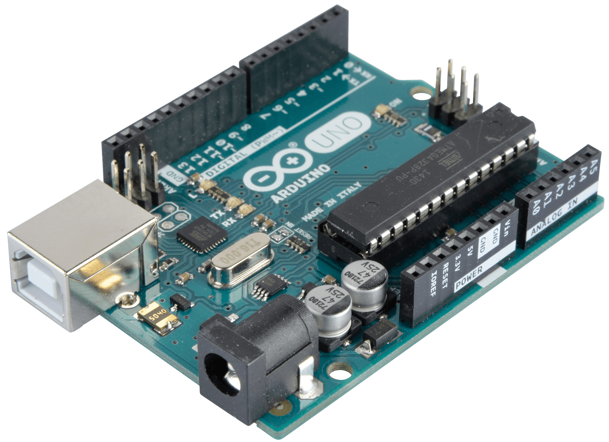

# Arduino_a_LenguajeDeProgramacion
## Fundamentos del lenguaje de programación Arduino

***La "inteligencia de Arduino" se expresa mediante su lenguaje de programación***  

### Contenido

1. [Estructura](https://github.com/DeveloperLuisF3/Arduino_a_LenguajeDeProgramacion/tree/master/estructura "estructura")
    * estructura
    * setup ()
    * loop ()
    * funciones
    * {} uso de llaves
    * ; punto y coma
    * /*...*/ bloque de comentarios
    * // linea de comentarios
2. [Variables](https://github.com/DeveloperLuisF3/Arduino_a_LenguajeDeProgramacion/tree/master/variables "ir a variables")
    * variables
    * declaración de variables
    * variable scope
3. [Tipos de datos](https://github.com/DeveloperLuisF3/Arduino_a_LenguajeDeProgramacion/tree/master/tiposDeDatos "ir a tipos de datos")
    * byte
    * int
    * long
    * float
    * arrays
4. [Aritmética](https://github.com/DeveloperLuisF3/Arduino_a_LenguajeDeProgramacion/tree/master/aritmetica "ir a aritmética")
    * aritmética
    * asignaciones compuestas
    * operadores de comparación
    * operadores lógicos
5. [Constantes](https://github.com/DeveloperLuisF3/Arduino_a_LenguajeDeProgramacion/tree/master/constantes "ir a constantes")
    * constantes
    * cierto/falso
    * alto/bajo
    * entrada/salida
6. [Control de flujo](https://github.com/DeveloperLuisF3/Arduino_a_LenguajeDeProgramacion/tree/master/controlDeFlujo "ir a control de flujo")
    * if
    * if... else
    * for
    * while
    * do... while
7. [E/S digitales](https://github.com/DeveloperLuisF3/Arduino_a_LenguajeDeProgramacion/tree/master/EntradasYsalidas_digitales "ir a entradas y salidas digitales")
    * pinMode (pin, mode)
    * digitalRead (pin)
    * digitalWrite (pin, value)
8. [E/S analógicas](https://github.com/DeveloperLuisF3/Arduino_a_LenguajeDeProgramacion/tree/master/EntradasYsalidas_analogicas "ir a entradas y salidas analógicas")
    * analogRead (pin)
    * analogWrite (pin, value)